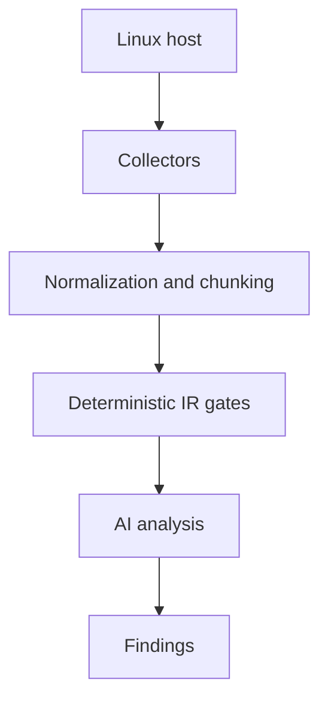

# HostTriageAI

**AI-assisted Linux host triage using high-signal telemetry**

Modern attackers blend into normal system behavior, abuse legitimate tools, and rely on techniques that evade traditional signatures. Detection often fails not because indicators are absent, but because tools cannot explain *why* something matters or *what to do next*.

HostTriageAI combines **deterministic, policy-driven detection** with **analyst-grade AI reasoning** to transform raw Linux host telemetry into actionable incident response insight.

It is designed to support **fast, defensible decisions** during host-level triage.

---

## Design goals

- **High signal over completeness**  
  Focus on telemetry attackers depend on and struggle to fully hide.

- **Deterministic first, AI second**  
  Certain host states (e.g., interactive shells bound to sockets) are never normal and should not be left to probabilistic judgment.

- **Assume uncertainty**  
  The analyzer does not assume the host is benign or well-understood.

- **Baseline inferred, not pre-defined**  
  The AI infers likely baseline behavior from host context instead of relying on static allowlists.

- **Human-verifiable output**  
  Every finding includes evidence, reasoning, and concrete next steps suitable for IR notes.

---

## What is collected

### Execution and runtime
- Root-owned processes
- Long-lived processes
- Process command lines and arguments
- Process parent/child relationships

### Network
- Listening sockets
- Established connections
- Owning process
- File descriptor context
- Optional socket inode metadata (when available)

### File descriptor context (high-signal)
- /proc/<pid>/fd mappings
- Detection of stdin/stdout/stderr redirected to sockets
- Correlation between interactive file descriptors and network connections

### Persistence
- System crontab and cron directories
- User crontabs
- /etc/init.d scripts
- rc.local metadata (if present)

### Authentication and access
- Last successful login sessions
- Failed authentication attempts
- SSH login history
- Active sessions
- SSH daemon configuration (metadata)
- Authorized SSH key metadata

### Privilege
- UID 0 users
- Detection of recent sudoers changes and high-risk rules

### Artifacts
- Executable files in /tmp and /dev/shm
- Common attacker staging locations

---

## How this tool detects high-risk behavior

HostTriageAI uses **deterministic IR gates** for conditions that should not be left to AI interpretation, including:

- Shell or interpreter processes owning active network sockets
- Interactive file descriptors (fd 0/1/2) redirected to network sockets
- Unexpected listeners bound to non-loopback interfaces
- Shell-backed reverse or bind shells

These detections:
- Override benign assumptions
- Override AI uncertainty
- Force a high-confidence compromise verdict unless disproven

The AI is then used to:
- Explain attacker tradecraft
- Correlate secondary indicators
- Recommend concrete next investigative steps
- Surface likely persistence or follow-on risk

---

## MITRE ATT&CK mapping

When deterministic shell/network findings are present, HostTriageAI automatically maps them to relevant MITRE ATT&CK techniques to support reporting and escalation:

- T1059.004 — Command and Scripting Interpreter: Unix Shell
- T1095 — Non-Application Layer Protocol
- T1571 — Non-Standard Port (when applicable)

Mappings are conservative and evidence-driven.  
No ATT&CK mapping is emitted without a concrete behavioral basis.

---

## How to use this tool

HostTriageAI is intended to be run **on-demand** for point-in-time host assessment.

### 1. Run the collector on the target host

From the repository directory:

\`\`\`bash
bash collect.sh ./host_facts.json
\`\`\`

This generates a **single JSON snapshot** containing all collected telemetry.

The collector:
- Does not modify system state
- Does not require systemd
- Is safe to run on live systems
- Intentionally limits output size

---

### 2. Run the analyzer locally

Once the facts file is generated:

\`\`\`bash
python3 analyze.py ./host_facts.json
\`\`\`

You should redirect output to a file during investigations:

\`\`\`bash
python3 analyze.py ./host_facts.json > findings.json
\`\`\`

---

### 3. Interpret the findings

Each finding includes:

- severity  
  How urgently this should be investigated

- category  
  (network, persistence, execution, privilege, lateral_movement, etc.)

- evidence  
  Raw telemetry that triggered the finding

- reasoning  
  Why this matters from an attacker tradecraft perspective

- recommended_next_step  
  Concrete commands or actions for responders

Findings are designed to be:
- Readable by humans
- Easy to paste into IR notes
- Actionable without additional tooling

---

## Intended use cases

### Incident response triage (single host)
- Rapid assessment during suspected compromise
- Identify:
  - Active reverse shells
  - Unexpected listeners
  - Suspicious long-lived processes
  - Persistence mechanisms
- Support contain / escalate decisions

Limitations:  
No memory analysis, no forensic timelines, no lateral movement attribution.

---

### Threat hunting (hypothesis-driven)
- Validate focused questions such as:
  - Is there an interactive shell with network access?
  - Is anything persisting that should not be?
  - Are temp directories used for execution?

---

### Suspicious host validation
- Cloud instances
- CI runners
- Jump boxes
- Ephemeral or purpose-built systems

---

### Post-alert enrichment
- Add host-level context to:
  - SIEM alerts
  - Firewall detections
  - Cloud security events

---

## This tool is not

- A vulnerability scanner
- A compliance or policy tool
- An EDR replacement
- A fleet monitoring solution

HostTriageAI is intentionally narrow and focused.

---

## Philosophy

> Collect what attackers cannot easily hide.  
> Analyze for meaning, not volume.

HostTriageAI exists to help responders make better decisions faster, not to replace deep forensic workflows.
