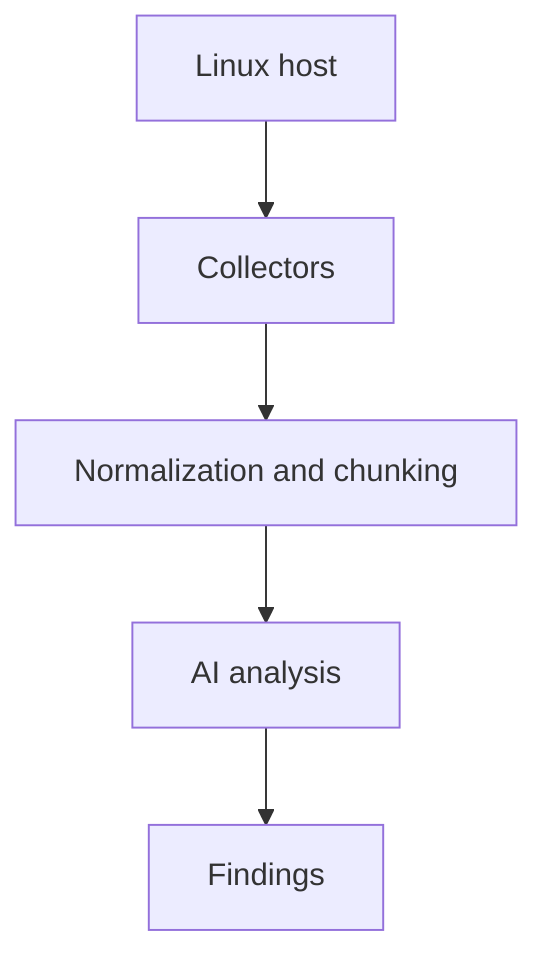

# HostTriageAI

**AI-assisted Linux host triage using high-signal telemetry**

HostTriageAI performs **point-in-time inspection of a Linux host** and uses an AI model to assess whether there is **anything suspicious that warrants investigation**.

In an ever-changing threat landscape, defenders are no longer just responding to known malware families or static indicators. Attackers increasingly blend into normal system behavior, abuse legitimate tooling, and experiment with AI-assisted tradecraft that does not yet have signatures or names. Traditional detection alone is often insufficient to explain why something matters or what to do next.

This project is designed to bridge that gap. It combines deterministic, policy-driven detection for high-confidence kill-chain events with analyst-grade AI reasoning that explains context, prioritizes risk, and provides concrete investigation steps. Rather than replacing security judgment, it augments it — turning raw host telemetry into actionable incident response insight, even for novel or previously unseen techniques.

The result is faster triage, clearer escalation decisions, and better outcomes when facing both familiar threats and emerging, hard-to-classify attack behaviors.

HostTriageAI helps by:
- Collecting **high-value, low-volume telemetry**
- Inferring a **likely baseline** for the host
- Highlighting **deviations that matter for IR**

---

## How it works



All collectors run independently.  
**Normalization and chunking are applied uniformly to all collected signals** before analysis.

---

## Design principles

- **High signal over completeness**  
  Focus on telemetry attackers rely on and struggle to fully hide.

- **Assume uncertainty**  
  The analyzer does not assume the host is benign.

- **Baseline inferred, not pre-defined**  
  The AI infers what “normal” likely looks like for the host context.

- **Human-verifiable output**  
  Every finding includes evidence, reasoning, and concrete next steps.

---

## What is collected today

### Execution and runtime
- Root-owned processes
- Long-lived processes
- Process command lines and arguments

### Network
- Listening sockets
- Established connections
- Owning process and file descriptor context

### Persistence
- System crontab and cron directories
- User crontabs
- `/etc/init.d` scripts
- `rc.local` metadata (if present)

### Authentication and access
- Last successful login sessions
- Failed authentication attempts
- SSH login history
- Active sessions
- SSH daemon configuration (metadata)
- Authorized SSH key metadata

### Privilege
- UID 0 users
- sudoers and sudoers.d

### Artifacts
- Executable files in `/tmp` and `/dev/shm`
- Common attacker staging locations

---

## How to use this tool

HostTriageAI is intended to be run **on-demand** when you need to quickly assess a host.

### 1. Run the collector on the target host

From the repository directory:

```bash
bash collect.sh ./host_facts.json
```

This generates a **single JSON snapshot** containing all collected telemetry.

The collector:
- Does **not** modify system state
- Does **not** require systemd
- Is safe to run on live systems
- Intentionally limits output size

---

### 2. Run the analyzer locally

Once the facts file is generated:

```bash
python3 analyze.py ./host_facts.json
```

The analyzer:
- Normalizes and chunks the data
- Sends it to the AI model
- Outputs a **structured JSON assessment**

You should redirect output to a file during investigations:

```bash
python3 analyze.py ./host_facts.json > findings.json
```

---

### 3. Interpret the findings

Each finding includes:

- **severity**  
  How urgently this should be investigated

- **category**  
  (network, persistence, execution, privilege, lateral_movement, etc.)

- **evidence**  
  Raw telemetry that triggered the finding

- **reasoning**  
  Why this matters from an attacker tradecraft perspective

- **recommended_next_step**  
  Concrete commands or actions for responders

Findings are designed to be:
- Readable by humans
- Easy to paste into IR notes
- Actionable without additional tooling

---

### 4. What to do with the output

HostTriageAI is best used to support decisions such as:

- Do we isolate this host?
- Do we escalate to full forensic acquisition?
- Is this behavior explainable or suspicious?
- What should we investigate next?

It is **not** intended to be the final authority — it is a **decision support tool**.

---

## Intended use cases (realistic)

HostTriageAI is suited for **single-host, point-in-time inspection** where fast signal extraction matters more than historical depth.

### Incident response triage (early-stage, host-level)
- Rapid assessment during suspected compromise
- Identify:
  - Active reverse shells
  - Unexpected listeners
  - Suspicious long-lived processes
  - Persistence mechanisms
- Support **contain / escalate decisions**

**Limitations:**  
No memory analysis, no forensic timelines, no lateral movement attribution.

---

### Threat hunting (hypothesis-driven, single host)
- Validate focused questions such as:
  - “Is there an interactive shell with network access?”
  - “Is anything persisting that shouldn’t be?”
  - “Are temp directories used for execution?”
- Useful when pivoting from alerts with limited context

---

### Suspicious host validation (cloud and ephemeral systems)
- Inspect short-lived or purpose-built systems:
  - Cloud instances
  - CI runners
  - Jump boxes
- Validate whether the host is doing **more than its intended role**

---

### Persistence & Remote Access
- Identify misuse of:
  - Unsafe persistence
  - Reverse shells
  - Execution from mounted external filesystems

---

### Post-alert enrichment
- Add host-level context to:
  - SIEM alerts
  - Firewall detections
  - Cloud security events

---

## Example high-severity finding (sanitized)

```json
{
  "overall_assessment": "likely_compromised",
  "confidence": 1.0,
  "context_summary": [
    "The host is running Ubuntu 20.04 LTS under WSL2 on a Windows environment.",
    "The system has many standard packages installed, including container tooling and audit frameworks.",
    "A local user is active and running interactive shell sessions.",
    "There is a user-level cron job running a Python script on a recurring two-hour schedule.",
    "Network listeners include a DNS service bound to a private address.",
    "The system uses SSH with password authentication disabled, indicating key-based access.",
    "The /tmp directory contains numerous user files consistent with Python package artifacts and development activity.",
    "No unusual system-level persistence mechanisms (e.g., modified rc.local or abnormal init scripts) were detected.",
    "Standard daily system cron jobs for maintenance and log rotation are present."
  ],
  "high_risk_indicators": [
    "Shell interpreter owns an established outbound TCP connection",
    "Outbound connection bound to interactive stdin/stdout file descriptors"
  ],
  "findings": [
    {
      "severity": "high",
      "category": "network",
      "evidence": "tcp 0 0 192.0.2.10:54321 198.51.100.25:9003 users:((\"sh\",pid=1234,fd=2),(\"sh\",pid=1234,fd=1),(\"sh\",pid=1234,fd=0))",
      "reasoning": "An established outbound network connection is owned directly by a shell or interpreter process (e.g., sh/bash/python/nc/socat). Interactive shells do not normally initiate or maintain persistent outbound TCP connections. The presence of active stdin/stdout file descriptors strongly aligns with reverse shell or live command-and-control tradecraft, making benign explanations unlikely without additional context.",
      "recommended_next_step": "1) Identify PID and parent: ps -fp <pid>; ps -o pid,ppid,user,etime,cmd -p <pid>\n2) Inspect process tree: pstree -asp <pid>\n3) Inspect /proc: readlink -f /proc/<pid>/exe; tr '\\0' ' ' < /proc/<pid>/cmdline\n4) Confirm remote endpoint: ss -tunp | grep <pid>\n5) Contain: isolate network or kill -STOP <pid> (preserve forensics), then acquire memory and disk images"
    },
    {
      "severity": "medium",
      "category": "persistence",
      "evidence": "A user cron job runs a python3 script at /mnt/shared/example_task.py every 2 hours.",
      "reasoning": "User-level cron jobs can be legitimate, but executing custom scripts from a mounted or shared directory is atypical and may represent a persistence mechanism. This warrants review to ensure it aligns with intended user activity and is not related to post-compromise persistence.",
      "recommended_next_step": "Review the contents of /mnt/shared/example_task.py for suspicious behavior. Confirm the legitimacy of this cron job with the system owner or user."
    }
  ],
  "verdict": {
    "suspicious": true,
    "why": "The system exhibits an active, established outbound TCP connection owned directly by a shell interpreter process. Shells do not normally maintain persistent network connections, particularly to non-standard ports, and the presence of interactive file descriptors strongly suggests remote interactive control. This pattern closely matches reverse shell or live command-and-control behavior and should be treated as active compromise until a benign explanation is conclusively verified."
  }
}
```

This class of finding should **override benign assumptions** and trigger immediate investigation.

---

## This tool is not

- A vulnerability scanner
- A compliance or policy tool
- An EDR replacement
- A fleet monitoring solution

HostTriageAI is intentionally **narrow and focused**.

---

## Philosophy

> **Collect what attackers cannot easily hide.  
> Analyze for meaning, not volume.**

HostTriageAI exists to help responders make **better decisions faster**, not to replace deep forensic workflows.
