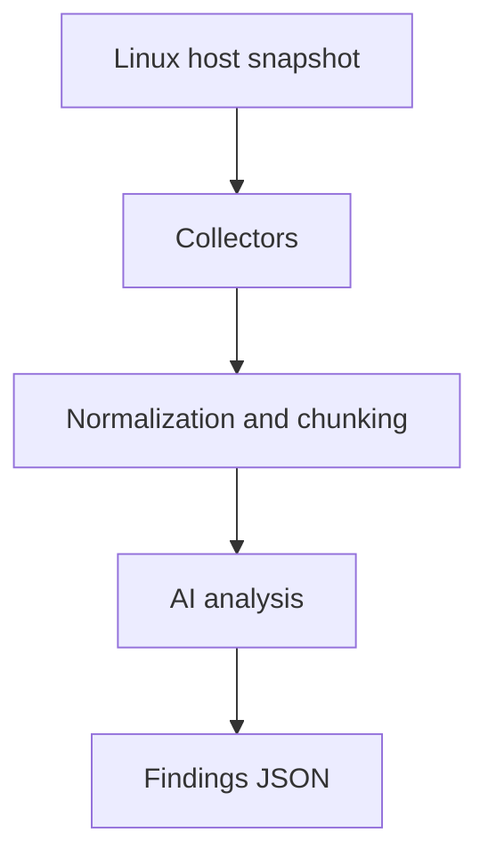

# HostTriageAI

**AI-assisted Linux host triage using high-signal telemetry**

HostTriageAI performs **point-in-time inspection of a Linux host** and uses an AI model to assess whether there is **anything suspicious that warrants investigation**.

The tool is designed to support **incident response and security triage**, not continuous monitoring, compliance auditing, or fleet-wide analytics.

---

## What problem this solves

During investigations, responders often need to answer a simple but critical question quickly:

> **Does this host show signs of compromise or unsafe behavior right now?**

HostTriageAI helps answer that question by:
- Collecting **high-value, low-volume telemetry**
- Inferring a **likely baseline** for the host
- Highlighting **deviations that matter for IR**

---

## How it works



All collectors run independently.  
**Normalization and chunking are applied uniformly to all collected signals** before analysis.

---

## Design principles

- **High signal over completeness**  
  Focus on telemetry attackers rely on and struggle to fully hide.

- **Assume uncertainty**  
  The analyzer does not assume the host is benign.

- **Baseline inferred, not pre-defined**  
  The AI infers what “normal” likely looks like for the host context.

- **Human-verifiable output**  
  Every finding includes evidence, reasoning, and concrete next steps.

---

## What is collected today

### Execution and runtime
- Root-owned processes
- Long-lived processes
- Process command lines and arguments

### Network
- Listening sockets
- Established connections
- Owning process and file descriptor context

### Persistence
- System crontab and cron directories
- User crontabs
- `/etc/init.d` scripts
- `rc.local` metadata (if present)

### Authentication and access
- Last successful login sessions
- Failed authentication attempts
- SSH login history
- Active sessions
- SSH daemon configuration (metadata)
- Authorized SSH key metadata

### Privilege
- UID 0 users
- sudoers and sudoers.d file hashes

### Artifacts
- Executable files in `/tmp` and `/dev/shm`
- Common attacker staging locations

---

## How to use this tool

HostTriageAI is intended to be run **on-demand** when you need to quickly assess a host.

### 1. Run the collector on the target host

From the repository directory:

```bash
bash collect.sh ./host_facts.json
```

This generates a **single JSON snapshot** containing all collected telemetry.

The collector:
- Does **not** modify system state
- Does **not** require systemd
- Is safe to run on live systems
- Intentionally limits output size

---

### 2. Run the analyzer locally

Once the facts file is generated:

```bash
python3 analyze.py ./host_facts.json
```

The analyzer:
- Normalizes and chunks the data
- Sends it to the AI model
- Outputs a **structured JSON assessment**

You should redirect output to a file during investigations:

```bash
python3 analyze.py ./host_facts.json > findings.json
```

---

### 3. Interpret the findings

Each finding includes:

- **severity**  
  How urgently this should be investigated

- **category**  
  (network, persistence, execution, privilege, lateral_movement, etc.)

- **evidence**  
  Raw telemetry that triggered the finding

- **reasoning**  
  Why this matters from an attacker tradecraft perspective

- **recommended_next_step**  
  Concrete commands or actions for responders

Findings are designed to be:
- Readable by humans
- Easy to paste into IR notes
- Actionable without additional tooling

---

### 4. What to do with the output

HostTriageAI is best used to support decisions such as:

- Do we isolate this host?
- Do we escalate to full forensic acquisition?
- Is this behavior explainable or suspicious?
- What should we investigate next?

It is **not** intended to be the final authority — it is a **decision support tool**.

---

## Intended use cases (realistic)

HostTriageAI is suited for **single-host, point-in-time inspection** where fast signal extraction matters more than historical depth.

### Incident response triage (early-stage, host-level)
- Rapid assessment during suspected compromise
- Identify:
  - Active reverse shells
  - Unexpected listeners
  - Suspicious long-lived processes
  - Persistence mechanisms
- Support **contain / escalate decisions**

**Limitations:**  
No memory analysis, no forensic timelines, no lateral movement attribution.

---

### Threat hunting (hypothesis-driven, single host)
- Validate focused questions such as:
  - “Is there an interactive shell with network access?”
  - “Is anything persisting that shouldn’t be?”
  - “Are temp directories used for execution?”
- Useful when pivoting from alerts with limited context

---

### Suspicious host validation (cloud and ephemeral systems)
- Inspect short-lived or purpose-built systems:
  - Cloud instances
  - CI runners
  - Jump boxes
- Validate whether the host is doing **more than its intended role**

---

### Developer workstation and WSL inspection
- Identify misuse of:
  - WSL instances
  - Developer machines running server-like services
- Detect:
  - Unsafe persistence
  - Reverse shells
  - Execution from mounted external filesystems

---

### Post-alert enrichment
- Add host-level context to:
  - SIEM alerts
  - Firewall detections
  - Cloud security events

---

## Example high-severity finding (sanitized)

```json
{
  "findings": [
    {
      "severity": "high",
      "category": "network",
      "evidence": "tcp     0        0           local_host:55742     remote_host:9003   users:((\"sh\",pid=1490,fd=2),(\"sh\",pid=1490,fd=1),(\"sh\",pid=1490,fd=0))",
      "reasoning": "Established outbound connection owned by an interactive shell/interpreter (sh/bash/python/nc/socat/etc). This matches reverse shell / live C2 tradecraft and should be treated as active compromise until disproven.",
      "recommended_next_step": "1) Identify PID and parent: ps -fp <pid>; ps -o pid,ppid,user,etime,cmd -p <pid>\n2) Inspect process tree: pstree -asp <pid>\n3) Inspect /proc: readlink -f /proc/<pid>/exe; tr '\\0' ' ' < /proc/<pid>/cmdline\n4) Confirm remote: ss -tunp | grep <pid>\n5) Contain: isolate network or kill -STOP <pid> (preserve forensics) then image if needed"
    }
  ]
}
```

This class of finding should **override benign assumptions** and trigger immediate investigation.

---

## This tool is not

- A vulnerability scanner
- A compliance or policy tool
- An EDR replacement
- A fleet monitoring solution

HostTriageAI is intentionally **narrow and focused**.

---

## Philosophy

> **Collect what attackers cannot easily hide.  
> Analyze for meaning, not volume.**

HostTriageAI exists to help responders make **better decisions faster**, not to replace deep forensic workflows.
