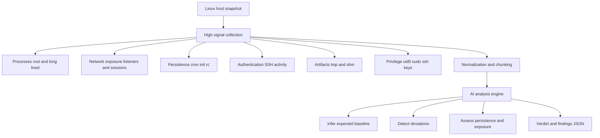

# HostTriageAI

**AI-assisted Linux host triage using high-signal telemetry**

HostTriageAI collects high-value, low-volume telemetry from a Linux host and submits it to an AI model to answer one operational question:

> **Is there anything suspicious on this host right now?**

It is built for **incident response and threat triage**, not compliance, asset inventory, or generic hardening.

---

## How it works



The diagram is text-native, dark-mode safe, and constrained to syntax that GitHub’s Mermaid renderer supports reliably.

---

## Design goals

- **High signal, low volume**  
  No full filesystem walks and no bulk log ingestion.

- **IR-first focus**  
  Persistence, execution, privilege, authentication, and network activity take priority.

- **Baseline inferred, not assumed**  
  The AI infers what normal should look like for the host and context.

- **Human-verifiable output**  
  Every finding includes evidence, reasoning, and concrete next steps.

---

## What is collected

### Execution and runtime
- Root processes
- Long-lived processes
- Network sockets with owning process

### Persistence
- System cron and cron directories
- User crontabs
- init.d scripts
- rc.local

### Authentication and access
- Last successful logins
- Failed authentication attempts
- Successful SSH logins
- Current interactive sessions
- SSH daemon authentication configuration
- Authorized SSH keys metadata

### Privilege
- UID 0 accounts
- Sudoers file hashes

### Artifacts
- Executable files in tmp and dev shm
- Common writable staging locations

---

## What this tool is not

- Not a compliance scanner  
- Not a vulnerability scanner  
- Not a full EDR replacement  
- Not a trust-based auditor  

HostTriageAI assumes the host **may already be compromised**.

---

## Example finding (high-confidence suspicious)

The following is a **sanitized example** of a finding that should be treated as **active compromise until disproven**.

```json
{
  "severity": "high",
  "category": "network",
  "evidence": "Established outbound TCP connection owned by an interactive shell process with STDIN and STDOUT attached",
  "reasoning": "An established outbound network connection directly owned by an interactive shell or interpreter is not normal for baseline Linux operation. This pattern strongly matches reverse shell or live command and control tradecraft and should be treated as an active compromise until conclusively disproven.",
  "recommended_next_step": [
    "Identify the process and its parent to determine execution origin",
    "Inspect the process tree to confirm interactive control",
    "Examine proc metadata to identify the executable and invocation context",
    "Validate the remote endpoint and scope of exposure",
    "Contain the process by isolating the host or pausing execution while preserving forensic evidence"
  ]
}
```

This class of finding should **override benign assumptions** and trigger immediate investigation.

---

## Intended use cases

- Incident response triage
- Threat hunting
- Suspicious host validation
- Cloud and ephemeral host inspection
- Developer workstation and WSL abuse detection

---

## Philosophy

> **Do not collect everything. Collect what attackers cannot hide.**

HostTriageAI is designed to surface meaningful deviations and high-confidence threat signals without drowning analysts in noise.
